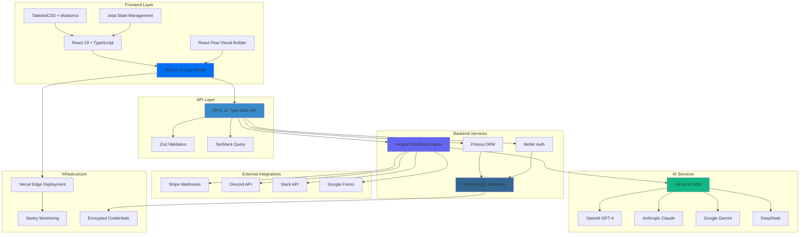
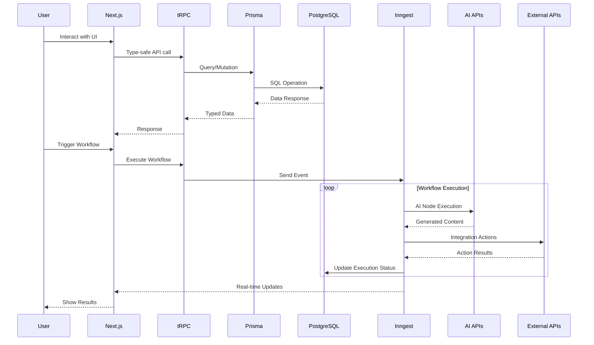

# CreatorFlow Tech Stack

Here's a comprehensive breakdown of the tech stack for your hackathon mentor:

## Frontend Layer

**Framework & UI**
- **Next.js 16** (App Router) - React framework with server-side rendering and file-based routing
- **React 19** - UI library with React Compiler for automatic optimizations
- **TypeScript 5.9+** - Type safety across the entire application
- **TailwindCSS v4** - Utility-first CSS framework for rapid styling
- **React Flow (@xyflow/react)** - Visual workflow builder with drag-and-drop node system

**UI Components**
- **Radix UI** - Accessible, unstyled component primitives
- **shadcn/ui** - Pre-built component library on top of Radix
- **Lucide React** - Icon system
- **class-variance-authority** - Type-safe component variants

## Backend Layer

**API & Database**
- **tRPC 11** - End-to-end type-safe API (no code generation, types flow from server to client)
- **Prisma 7.8** - Type-safe ORM for database operations
- **PostgreSQL** - Relational database for data persistence
- **Better Auth (@polar-sh/better-auth)** - Modern authentication with session management

**Workflow Engine**
- **Inngest 3.54** - Serverless workflow orchestration
  - Handles retry logic and error recovery
  - Event-driven architecture
  - Durable execution guarantees
  - Real-time monitoring via @inngest/realtime

## State Management

- **Jotai** - Atomic state management for global UI state
- **TanStack Query (React Query)** - Server state caching and synchronization with tRPC
- **nuqs** - Type-safe URL search parameter management
- **Zod 4** - Runtime schema validation and TypeScript type inference

## AI Integration

**Vercel AI SDK** - Unified interface for multiple AI providers:
- **@ai-sdk/openai** - GPT-4 for content generation
- **@ai-sdk/anthropic** - Claude for content analysis
- **@ai-sdk/google** - Gemini for multimodal tasks
- **@ai-sdk/deepseek** - DeepSeek for cost-effective AI operations

## External Integrations

- **Stripe** - Payment webhooks and processing
- **Discord SDK** - Notifications and bot interactions
- **Slack SDK** - Team notifications
- **Google Forms API** - Form submission triggers

## Security & Encryption

- **cryptr** - AES-256 encryption for API keys and credentials
- **Better Auth** - Secure session management with httpOnly cookies
- **Environment Variables** - Secrets management via .env.local

## Developer Tools

- **Bun** - Fast package manager and JavaScript runtime (replaces npm/yarn)
- **Biome** - Fast linter and formatter (replaces ESLint + Prettier)
- **mprocs** - Multi-process orchestration for running dev servers
- **dotenv-cli** - Environment variable loading

## Deployment & Monitoring

- **Vercel** - Edge deployment platform
- **Sentry (@sentry/nextjs)** - Error tracking and performance monitoring
- **Vercel Analytics** - Web analytics and user insights

## Development Workflow

```bash
# Development servers
bun dev          # Next.js dev server
bun inngest      # Inngest workflow engine
bun dev:all      # Both servers simultaneously

# Database management
prisma generate  # Generate Prisma client
prisma db push   # Sync schema to database
prisma migrate   # Create migrations

# Code quality
bun lint         # Biome linter
bun format       # Biome formatter
```

---

## Architecture Diagram (Mermaid)



## Data Flow Architecture



## Key Architecture Benefits

1. **End-to-End Type Safety**: TypeScript → Zod → Prisma → tRPC → React (no type mismatches possible)
2. **Serverless Scalability**: Inngest handles workflow orchestration without managing infrastructure
3. **Real-time Updates**: Inngest realtime provides live execution status to users
4. **Security First**: Encrypted credentials, session-based auth, row-level security
5. **Developer Experience**: Fast builds with Bun, instant feedback with Biome, type inference everywhere
6. **Cost Efficiency**: Edge deployment on Vercel, pay-per-execution with Inngest

This stack was chosen to maximize development speed during the hackathon while maintaining production-grade reliability for scaling after the event.